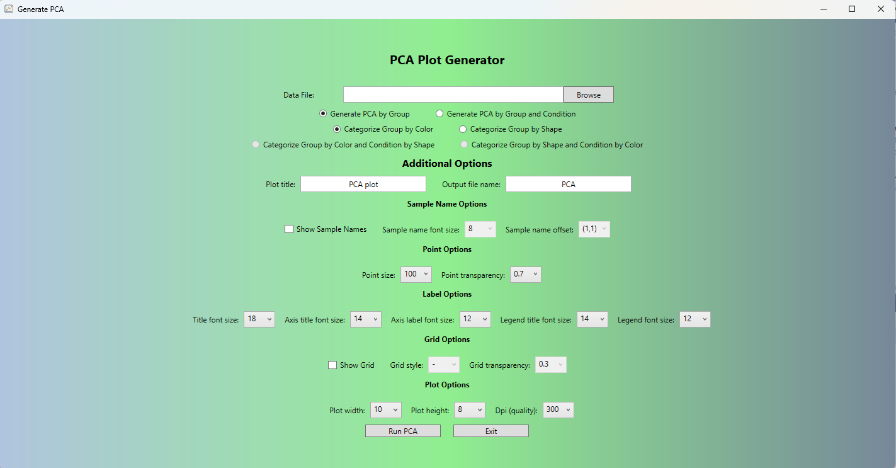
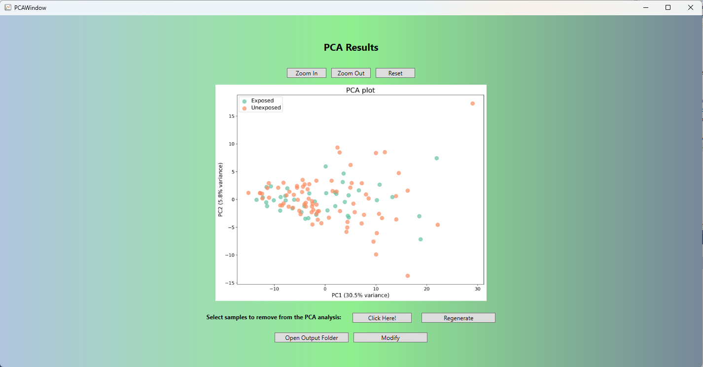

# PCAGenerator

A desktop application (WPF + PythonNET) for performing Principal Component Analysis (PCA) on gene expression (or other numeric) datasets.  
Supports grouping, optional exclusion of samples, customizable plotting, and interactive viewing via a zoomable image window.

---

## 📋 Table of Contents

- [Features](#features)  
- [Requirements](#requirements)  
- [Installation / Setup](#installation--setup)  
- [Usage](#usage)  
  - Run PCA  
  - Regenerate / Exclude Samples  
  - Zoom & Pan Plot  
- [Customization & Settings](#customization--settings)  
- [License](#license)  
- [Screenshots](#screenshots)

---

## 🚀 Features

- Accepts input data in CSV format with metadata rows 
- Optionally **exclude** specified samples prior to PCA  
- Visualize PCA with points colored or shaped by group / condition  
- Display sample names on plot  
- Zoom / pan interactive plot window  
- Regenerate PCA runs with updated settings  
- Packaging includes a .NET and Python runtime so users don’t need to install Python or .NET runtimes separately

---

## 🛠 Requirements

- .NET (for WPF) — version matching project target (e.g. .NET 8) 
- Application is built as a self contained executable, so users do not need to install .NET separately
- Embedded Python runtime (shipped within the `Python/` folder)  
- Python dependencies (via `site-packages`) for the PCA script (e.g. `numpy`, `pandas`, `scikit-learn`, `seaborn`, `matplotlib`)  
- For development: Visual Studio (or other C# IDE) + Python development tools  

---

## 📦 Installation / Setup (for Users)

1. Download the prebuilt latest ZIP / release.
2. Extract the ZIP to a desired location.
3. Ensure the `Python/` and `Images/` folders accompany the executable in the same directory.  
4. Run `PCAGenerator.exe`.  
5. Provide an input file, configure settings, and press “Run PCA”.

---

## 📊 Usage

### Run PCA

- Load an input file (CSV) that follows the required format:  
  - Row 1: Sample IDs  
  - Row 2: Group names  
  - (Optional) Row 3: Condition names  
  - From row 3 or 4 onward: features / genes in rows, samples in columns  

- Choose whether to *Generate PCA by Group* or *by Group + Condition*.  
- Select categorization options (color, shape) depending on mode.  
- Modify any customization parameters as desired.
- Click **Run PCA**.
- Optionally exclude certain samples after the initial PCA run (via dropdown).

### Regenerate / Exclude Samples

- After an initial PCA run, use the “Regenerate” button to re-run with updated exclusions.  
- Select samples to exclude, then rerun.  
- The plot refreshes with excluded samples removed from analysis but still visible in the exclusion UI.

### Zoom & Pan Plot

- The PCA plot window displays a zoomable, scrollable image.  
- Use mouse wheel or provided **Zoom In / Zoom Out** buttons (if implemented) to adjust zoom scale.  
- Pan by dragging / scrollbars.

---

## ⚙ Customization & Settings

You can customize the PCA appearance via parameters in the GUI (mapped to the Python script), including:

| Parameter           | Purpose / Default                            |
|---------------------|-----------------------------------------------|
| Sample name fontsize | Size of sample ID text labels                 |
| Offset               | x,y offset for sample name label positioning |
| Point alpha / size   | Transparency & size of scatter points         |
| Title / label fonts  | Font sizes for plot title and axis labels     |
| Grid style / alpha   | Styling of background grid                    |
| Exclude samples      | List of sample IDs to exclude                 |

These map to arguments passed to the Python `pca_plot` function in the backend.

---

## 📄 License

This project is licensed under the GPL-3.0 License. See the [LICENSE](LICENSE) file for details.

---

## 📸 Screenshots
### Main Window

### PCA Plot Window

